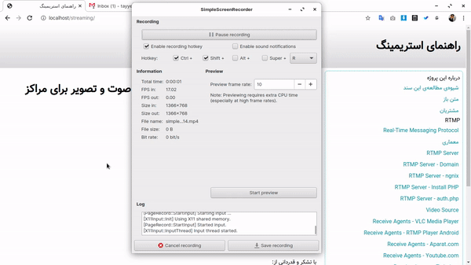

راهنمای راه‌اندازی استریمینگ (پخش بلادرنگ صوت و تصویر)
===

# محتویات این مخزن
راهنمای راه‌اندازی سریع یک سامانه‌ی اسرتیمینگ

# ساختن خروجی
برای تولید خروجی HTML لطفا از دستور زیر استفاده کنید:
```
python3 program/main.py
```

# مشارکت در این پروژه


<hr/>

تولید شده با استفاده از مستند ساز [گردرگ](https://github.com/gordarg)